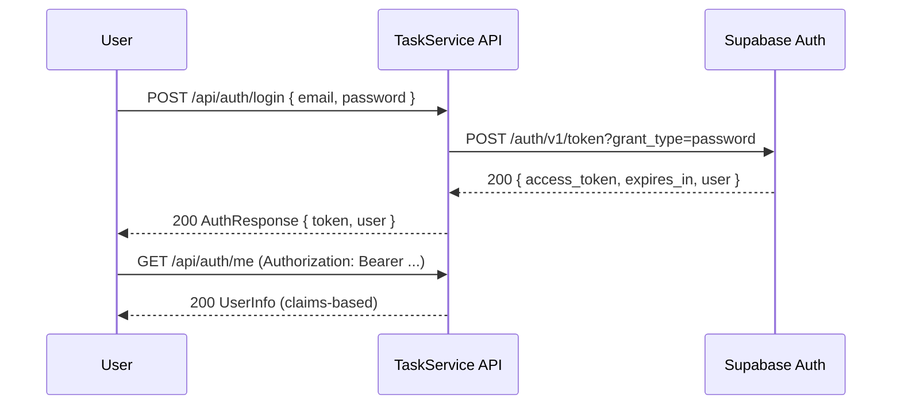

# Auth Flow

```mermaid
sequenceDiagram
  participant U as User
  participant API as TaskService API
  participant SA as Supabase Auth

  U->>API: POST /api/auth/login { email, password }
  API->>SA: POST /auth/v1/token?grant_type=password
  SA-->>API: 200 { access_token, expires_in, user }
  API-->>U: 200 AuthResponse { token, user }

  U->>API: GET /api/auth/me (Authorization: Bearer ...)
  API-->>U: 200 UserInfo (claims-based)
```

