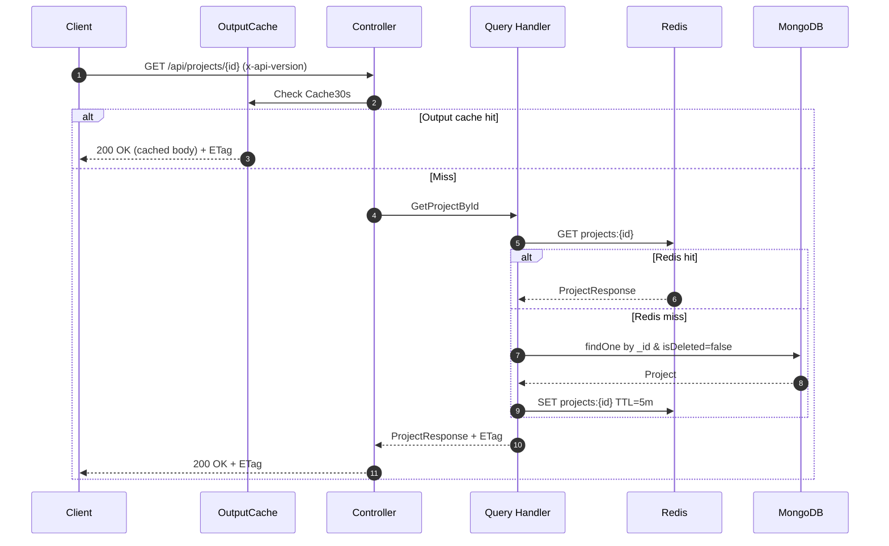

# Caching Flow

```mermaid
sequenceDiagram
  autonumber
  participant C as Client
  participant OC as OutputCache
  participant API as Controller
  participant App as Query Handler
  participant R as Redis
  participant M as MongoDB

  C->>API: GET /api/projects/{id} (x-api-version)
  API->>OC: Check Cache30s
  alt Output cache hit
    OC-->>C: 200 OK (cached body) + ETag
  else Miss
    API->>App: GetProjectById
    App->>R: GET projects:{id}
    alt Redis hit
      R-->>App: ProjectResponse
    else Redis miss
      App->>M: findOne by _id & isDeleted=false
      M-->>App: Project
      App->>R: SET projects:{id} TTL=5m
    end
    App-->>API: ProjectResponse + ETag
    API-->>C: 200 OK + ETag
  end
```

