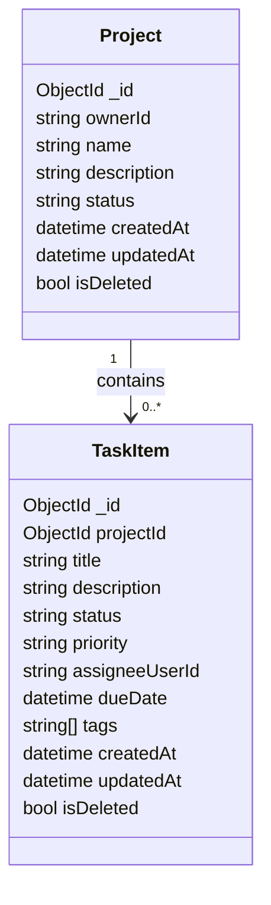

# Entity Relationship (classDiagram alternative for broader Mermaid support)

```mermaid
classDiagram
  class Project {
    ObjectId _id
    string ownerId
    string name
    string description
    string status
    datetime createdAt
    datetime updatedAt
    bool isDeleted
  }

  class TaskItem {
    ObjectId _id
    ObjectId projectId
    string title
    string description
    string status
    string priority
    string assigneeUserId
    datetime dueDate
    string[] tags
    datetime createdAt
    datetime updatedAt
    bool isDeleted
  }

  Project "1" --> "0..*" TaskItem : contains
```

