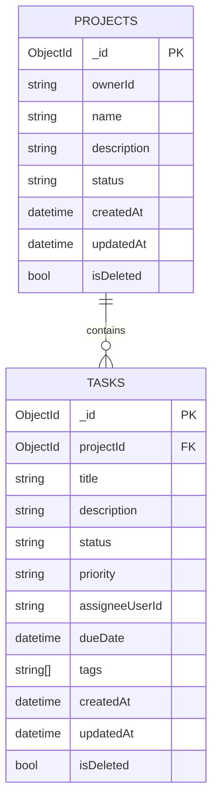

# Entity Relationship

```mermaid
erDiagram
  PROJECTS {
    ObjectId _id PK
    string ownerId
    string name
    string description
    string status
    datetime createdAt
    datetime updatedAt
    bool isDeleted
  }
  TASKS {
    ObjectId _id PK
    ObjectId projectId FK
    string title
    string description
    string status
    string priority
    string assigneeUserId
    datetime dueDate
    string[] tags
    datetime createdAt
    datetime updatedAt
    bool isDeleted
  }
  PROJECTS ||--o{ TASKS : contains
```

