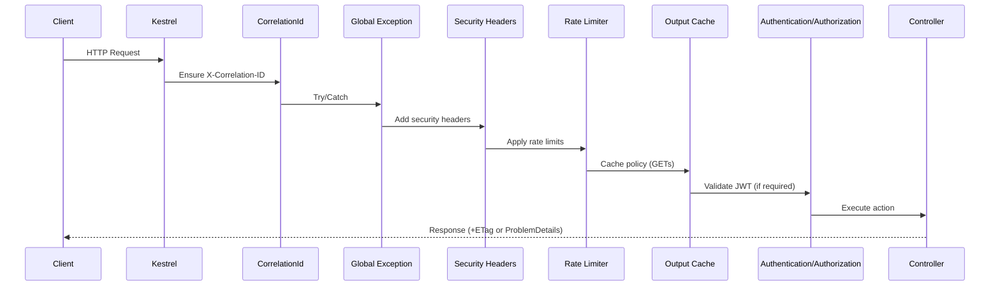

# HTTP Request Pipeline

```mermaid
sequenceDiagram
  participant C as Client
  participant K as Kestrel
  participant Cor as CorrelationId
  participant Ex as Global Exception
  participant Sec as Security Headers
  participant RL as Rate Limiter
  participant OC as Output Cache
  participant Auth as Authentication/Authorization
  participant Ctrl as Controller

  C->>K: HTTP Request
  K->>Cor: Ensure X-Correlation-ID
  Cor->>Ex: Try/Catch
  Ex->>Sec: Add security headers
  Sec->>RL: Apply rate limits
  RL->>OC: Cache policy (GETs)
  OC->>Auth: Validate JWT (if required)
  Auth->>Ctrl: Execute action
  Ctrl-->>C: Response (+ETag or ProblemDetails)
```

