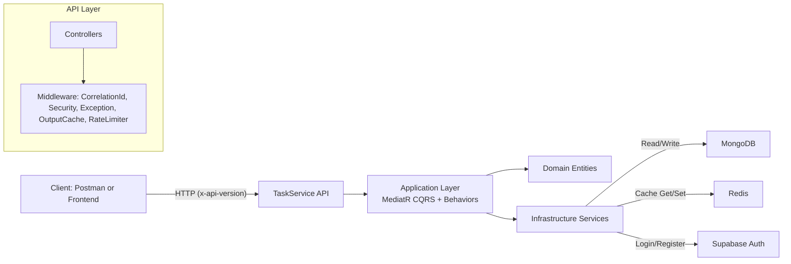

# Overall Architecture

```mermaid
graph LR
  Client["Client: Postman or Frontend"] -- "HTTP (x-api-version)" --> API["TaskService API"]

  subgraph API_Layer["API Layer"]
    Ctrls["Controllers"]
    MW["Middleware: CorrelationId, Security, Exception, OutputCache, RateLimiter"]
    Ctrls --> MW
  end

  API --> App["Application Layer<br/>MediatR CQRS + Behaviors"]
  App --> Dom["Domain Entities"]
  App --> Infra["Infrastructure Services"]

  Infra -- "Read/Write" --> Mongo["MongoDB"]
  Infra -- "Cache Get/Set" --> Redis["Redis"]
  Infra -- "Login/Register" --> Supabase["Supabase Auth"]
```
