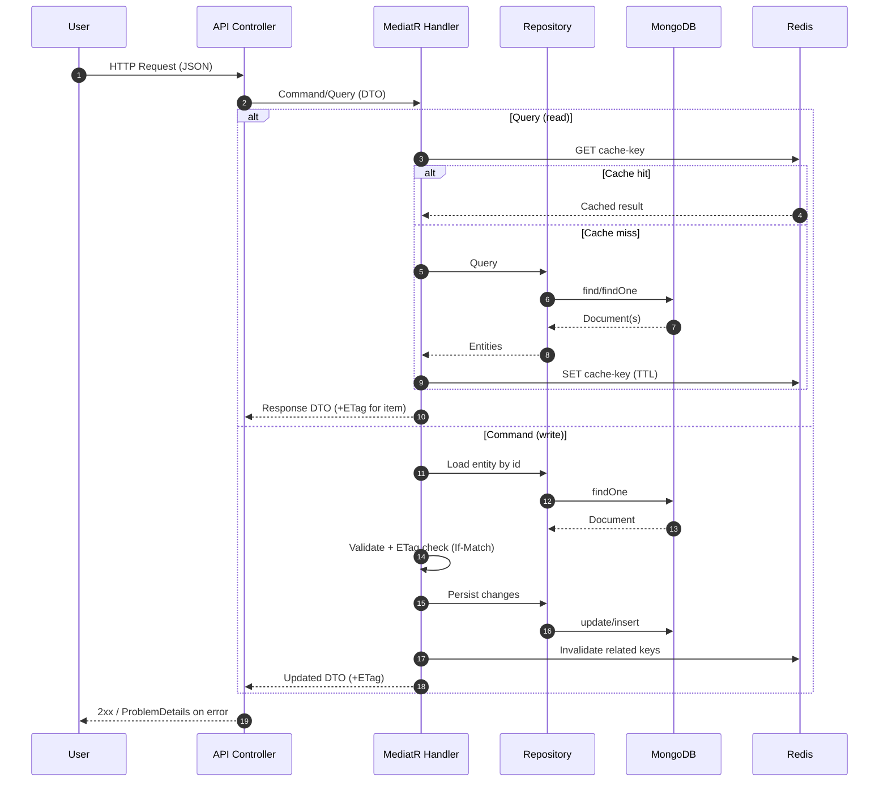

# Request Flow

```mermaid
sequenceDiagram
  autonumber
  participant U as User
  participant API as API Controller
  participant App as MediatR Handler
  participant Repo as Repository
  participant M as MongoDB
  participant R as Redis

  U->>API: HTTP Request (JSON)
  API->>App: Command/Query (DTO)
  alt Query (read)
    App->>R: GET cache-key
    alt Cache hit
      R-->>App: Cached result
    else Cache miss
      App->>Repo: Query
      Repo->>M: find/findOne
      M-->>Repo: Document(s)
      Repo-->>App: Entities
      App->>R: SET cache-key (TTL)
    end
    App-->>API: Response DTO (+ETag for item)
  else Command (write)
    App->>Repo: Load entity by id
    Repo->>M: findOne
    M-->>Repo: Document
    App->>App: Validate + ETag check (If-Match)
    App->>Repo: Persist changes
    Repo->>M: update/insert
    App->>R: Invalidate related keys
    App-->>API: Updated DTO (+ETag)
  end
  API-->>U: 2xx / ProblemDetails on error
```

